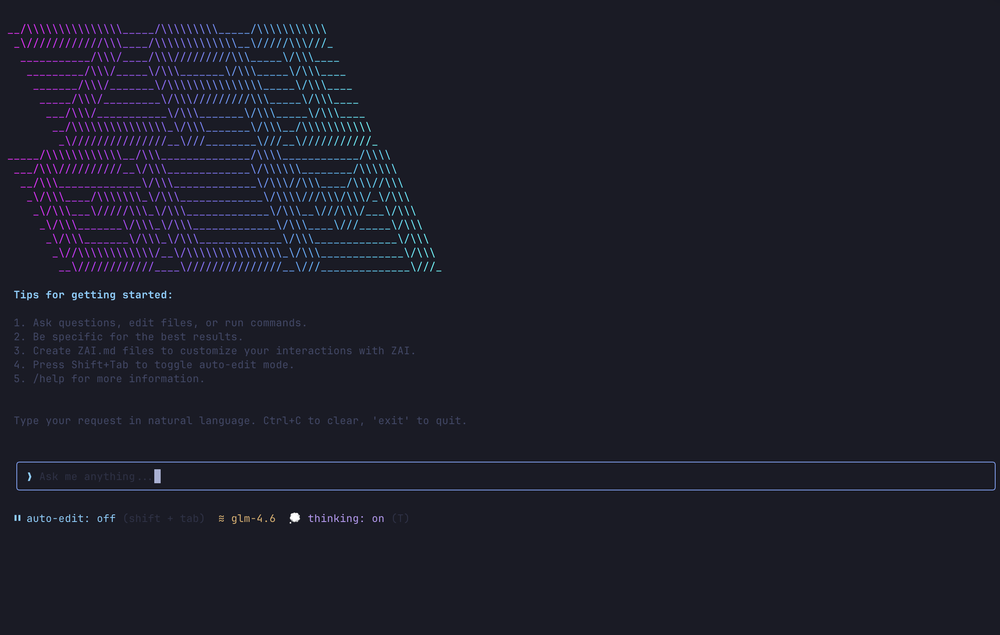

# ZAI CLI

[](https://www.npmjs.com/package/@guizmo-ai/zai-cli)
[](https://opensource.org/licenses/MIT)
[](https://nodejs.org)

> A conversational AI CLI tool powered by Z.ai GLM models with intelligent text editing and tool usage.

Forked from [superagent-ai/grok-cli](https://github.com/superagent-ai/grok-cli) and enhanced with advanced features for the Z.ai GLM ecosystem.



## ✨ New in v0.2.0

Powerful new features to enhance your workflow:

- **📜 Persistent Command History** - Your command history is saved across sessions in `~/.zai/history.json`, so you never lose your workflow
- **🔍 Ctrl+R Fuzzy Search** - Instantly find and reuse previous commands with reverse search through your history
- **👁️ Interactive Diff Viewer** - Preview all file changes before applying them, with options to accept, reject, or view full diffs
- **💾 Automatic Backups** - Files are automatically backed up before editing to `~/.zai/backups/`, ensuring you can always recover previous versions

### Keyboard Shortcuts

- **↑/↓** - Navigate through command history
- **Ctrl+R** - Reverse search through command history (fuzzy search)
- **Diff Viewer:**
  - `a` - Accept changes and apply to file
  - `r` - Reject changes and discard
  - `d` - Toggle between summary and full diff view

## 🚀 Quick Start

### Installation

```bash
# Install from npm (recommended)
npm install -g @guizmo-ai/zai-cli

# Or with Bun
bun add -g @guizmo-ai/zai-cli
```

### First Run

```bash
zai
```

The interactive wizard will guide you through:
1. Enter your Z.ai API key ([get one here](https://z.ai/manage-apikey/apikey-list))
2. Select default model (GLM-4.6 recommended)
3. Start chatting!

Configuration is saved to `~/.zai/user-settings.json`.

## ✨ What's Different from grok-cli?

### 🎯 GLM Model Integration
- **Native Z.ai GLM support** - Built specifically for GLM-4.6, GLM-4.5, and GLM-4.5-Air
- **200K context window** - Leverage GLM-4.6's massive context for complex projects
- **Optimized prompting** - Tailored system prompts for GLM model reasoning patterns

### 🚀 Interactive Onboarding
- **First-run wizard** - Guided setup with no manual config needed
- **Interactive settings panel** - Manage API keys and models with `zai config`
- **Smart defaults** - Pre-configured for Z.ai endpoints and best practices

### 🧠 Advanced Features
- **Thinking mode** - Visualize AI reasoning process in real-time (GLM extended thinking)
- **Batch editing** - Apply changes across multiple files simultaneously
- **File watching** - Real-time detection of external file changes
- **Session persistence** - Save and restore conversations with full context
- **Typed error system** - Contextual error messages with actionable suggestions

### 🛠️ Enhanced Tooling
- **90+ tests** - Comprehensive test suite with Vitest
- **Error recovery** - Intelligent error handling with retry mechanisms
- **Metrics tracking** - Built-in performance and usage monitoring

## 📖 Core Features

### 🤖 Conversational AI
Natural language interface with Z.ai GLM models:
- **GLM-4.6** (200K context) - Best for complex coding and reasoning
- **GLM-4.5** (128K context) - Balanced performance
- **GLM-4.5-Air** - Fast and lightweight

### 📝 Smart File Operations
AI automatically:
- Views, creates, and edits files with **interactive diff preview**
- Executes shell commands with **persistent history**
- Selects appropriate tools
- Handles multi-file operations with **automatic backups**
- **Ctrl+R fuzzy search** through command history

### ⚙️ Settings Management

```bash
# Interactive settings panel
zai config

# View configuration
zai config --show

# Update API key
zai config --set-key YOUR_KEY

# Reset to defaults
zai config --reset
```

### 💻 Usage Modes

**Interactive Mode:**
```bash
zai                          # Start in current directory
zai -d /path/to/project     # Specify working directory
```

**Headless Mode** (for scripts/CI):
```bash
zai --prompt "analyze package.json and suggest improvements"
zai -p "run tests" --max-tool-rounds 50
```

### 🎨 Model Selection

```bash
# Command line
zai --model glm-4.6

# Environment variable
export ZAI_MODEL=glm-4.5
zai

# User settings (persistent)
zai config  # Select "Change Default Model"
```

## 🔧 Configuration

### Environment Variables

```bash
export ZAI_API_KEY=your_api_key_here
export ZAI_BASE_URL=https://api.z.ai/api/paas/v4  # Optional
export ZAI_MODEL=glm-4.6                           # Optional
```

### Custom Instructions

Create `.zai/ZAI.md` in your project:

```markdown
# Project Guidelines

- Use TypeScript with strict mode
- Follow functional programming patterns
- Add JSDoc comments for public APIs
- Write tests for all new features
```

ZAI will automatically follow these instructions when working in your project.

### Project Settings

Create `.zai/settings.json` for project-specific configuration:

```json
{
  "model": "glm-4.5",
  "mcpServers": {
    "linear": {
      "name": "linear",
      "transport": "sse",
      "url": "https://mcp.linear.app/sse"
    }
  }
}
```

## 🔌 MCP Integration

Extend ZAI with Model Context Protocol servers:

```bash
# Add Linear integration
zai mcp add linear --transport sse --url https://mcp.linear.app/sse

# Add custom MCP server
zai mcp add my-server --transport stdio --command "bun" --args server.js

# List servers
zai mcp list

# Test connection
zai mcp test linear
```

## ⚡ Morph Fast Apply (Optional)

Enable high-speed editing at 4,500+ tokens/sec:

```bash
export MORPH_API_KEY=your_morph_key
```

When enabled:
- `edit_file` tool for complex refactoring
- Intelligent diff-based editing
- 98% accuracy on code changes

## 📊 Advanced Features

### 📜 Command History & Search
Your command history is automatically saved across sessions:
```bash
# History saved to ~/.zai/history.json
# Use ↑/↓ to navigate through previous commands
# Press Ctrl+R for fuzzy search through history
```

**Pro tip:** The history search supports fuzzy matching, so you can quickly find commands even if you don't remember the exact wording.

### 👁️ Interactive Diff Viewer
Preview all file changes before they're applied:
```bash
# When AI suggests file changes, you'll see:
# - Side-by-side diff view
# - Summary of changes
# - Options to accept (a), reject (r), or view full diff (d)
```

This ensures you maintain full control over what changes are made to your codebase.

### 💾 Automatic Backups
Every file edit is automatically backed up:
```bash
# Backups stored in ~/.zai/backups/
# Organized by timestamp
# Easy recovery if something goes wrong
```

### Session Persistence
Save and restore conversations:
```bash
# Sessions auto-save to ~/.zai/sessions/
# Restore on restart with full context
```

### Batch Editing
Apply changes across multiple files in one operation:
```bash
zai --prompt "rename function foo to bar in all .ts files"
```

### File Watching
Real-time detection when files change outside ZAI:
```bash
# Automatic notification when watched files are modified
# Prevents conflicts and lost work
```

### Thinking Mode
Visualize AI reasoning (GLM extended thinking):
```bash
# See reasoning steps in real-time
# Understand decision-making process
# Available with GLM-4.6
```

## 🛠️ Development

```bash
# Clone the repository
git clone https://github.com/guizmo-ai/zai-glm-cli.git
cd zai-glm-cli

# Install dependencies
npm install

# Development mode
npm run dev

# Build
npm run build

# Run tests
npm test

# Type check
npm run typecheck
```

## 📋 Command Reference

```bash
zai [options]

Options:
  -V, --version                 Version number
  -d, --directory <dir>         Working directory
  -k, --api-key <key>           Z.ai API key
  -u, --base-url <url>          API base URL
  -m, --model <model>           AI model (glm-4.6, glm-4.5, glm-4.5-air)
  -p, --prompt <prompt>         Headless mode - process and exit
  --max-tool-rounds <rounds>    Max tool executions (default: 400)
  -h, --help                    Show help

Commands:
  config [options]              Manage settings
  mcp <action> [options]        Manage MCP servers
```

## 🔄 Migration from grok-cli

1. Install ZAI CLI:
   ```bash
   npm install -g @guizmo-ai/zai-cli
   ```

2. Copy settings (optional):
   ```bash
   cp -r ~/.grok ~/.zai
   ```

3. Update configuration:
   ```bash
   zai config
   # Enter Z.ai API key
   # Select GLM model
   ```

4. Environment variables:
   - `GROK_API_KEY` → `ZAI_API_KEY`
   - `GROK_BASE_URL` → `ZAI_BASE_URL`
   - `GROK_MODEL` → `ZAI_MODEL`

## 📦 Architecture

- **Agent** - Z.ai GLM-powered command processing with extended thinking
- **Tools** - File operations, bash execution, batch editing
- **UI** - React Ink interface with onboarding and settings panels
- **Settings** - Two-tier config (user + project)
- **MCP** - Protocol support for extensibility

## 🤝 Contributing

Contributions are welcome! Please feel free to submit a Pull Request.

1. Fork the repository
2. Create your feature branch (`git checkout -b feature/AmazingFeature`)
3. Commit your changes (`git commit -m 'Add some AmazingFeature'`)
4. Push to the branch (`git push origin feature/AmazingFeature`)
5. Open a Pull Request

## 🙏 Credits

Based on [grok-cli](https://github.com/superagent-ai/grok-cli) by Superagent AI.

Enhanced for Z.ai GLM models with:
- Interactive onboarding and configuration
- GLM-specific optimizations and thinking mode
- Advanced tooling (batch editing, file watching, sessions)
- Comprehensive error handling and testing

## 📄 License

MIT License - Copyright (c) 2025 Guizmo AI

See [LICENSE](LICENSE) file for details.

---

**Get started:** `npm install -g @guizmo-ai/zai-cli && zai`

**Need help?** Open an issue on [GitHub](https://github.com/guizmo-ai/zai-glm-cli/issues)
